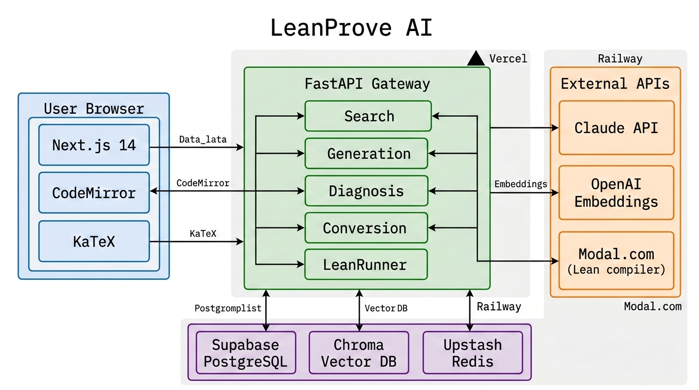

# 系统架构设计 - LeanProve AI

## 项目信息

| 字段 | 内容 |
|------|------|
| 项目名称 | LeanProve AI |
| 架构版本 | v1.0 |
| 创建日期 | 2026-03-06 |

---

## 1. 架构风格

采用**前后端分离 + 微服务**架构。前端 SPA 通过 REST API 与后端通信；后端按领域拆分为核心服务（搜索、生成、诊断）和基础服务（认证、计费）；Lean 编译检查通过 Modal.com 无服务器函数异步执行。

---

## 2. 技术选型

| 层级 | 技术 | 理由 |
|------|------|------|
| 前端 | Next.js 14 + CodeMirror 6 + KaTeX | SSR/SSG 性能优；CodeMirror 可定制 Lean 语法；KaTeX 渲染快 |
| 后端 | Python FastAPI | 异步高性能；与 ML/AI 生态兼容；类型提示完善 |
| 数据库 | Supabase (PostgreSQL 15) | 托管 Postgres + Auth + Realtime；Row Level Security |
| 缓存 | Redis (Upstash) | Serverless Redis；API 限流 + 搜索结果缓存 |
| 消息队列 | Redis Streams | 轻量级；复用 Redis 实例；Lean 编译任务队列 |
| 对象存储 | Supabase Storage | 与数据库同一平台；存储用户上传的 Lean 项目文件 |
| 向量数据库 | Chroma | 开源轻量；支持持久化；适合 20 万级文档规模 |

---

## 3. 整体架构描述

用户通过 Next.js 前端访问平台，所有请求经 FastAPI 网关路由到对应服务模块。搜索服务查询 Chroma 向量库，生成/诊断/转换服务调用 Claude API。Lean 编译检查任务通过 Redis Streams 分发到 Modal.com 无服务器实例执行。用户数据和会话存储在 Supabase PostgreSQL 中，搜索结果和热门定理缓存在 Redis。

---

## 4. 核心模块

| 模块 | 职责 | 输入 | 输出 |
|------|------|------|------|
| SearchService | Mathlib 语义搜索 | 自然语言查询字符串 | Top-K 定理列表（名称+签名+相似度） |
| GenerationService | 证明草稿生成 | 自然语言定理描述 + 上下文 | Lean 4 代码字符串 + 使用的引理列表 |
| DiagnosisService | 错误诊断 | Lean 代码 + 编译错误信息 | 错误解释 + 修复建议列表 |
| ConversionService | LaTeX↔Lean 转换 | LaTeX 或 Lean 表达式 | 转换后的对应表达式 |
| LeanRunnerService | Lean 编译执行 | Lean 4 源代码 | 编译结果（成功/错误列表） |
| AuthService | 用户认证与授权 | OAuth token / 邮箱密码 | JWT + 用户信息 |
| BillingService | 订阅与用量管理 | 用户 ID + 操作类型 | 计费状态 + 剩余额度 |
| EmbeddingPipeline | Mathlib 定理向量化 | Mathlib 源文件 | Chroma 向量索引 |

---

## 5. 外部依赖

| 依赖 | 用途 | SLA | 降级方案 |
|------|------|-----|----------|
| Claude API (Anthropic) | 证明生成/诊断/转换 | 99.5% | 缓存高频查询；排队重试 |
| OpenAI Embeddings API | 文本向量化 | 99.9% | 本地备用模型 (sentence-transformers) |
| Modal.com | Lean 编译运行 | 99.9% | 本地 Lean 实例备用 |
| Supabase | 数据库 + Auth | 99.95% | 本地 PostgreSQL 热备 |
| Stripe | 支付 | 99.99% | Webhook 重放队列 |
| Upstash Redis | 缓存/队列 | 99.99% | 应用内 LRU 缓存降级 |

---

## 6. 核心数据流

### 6.1 Mathlib 语义搜索

```
用户输入查询 → FastAPI → Embedding API 向量化
  → Chroma 相似度检索 Top-20
  → 重排序(Claude rerank) → 返回 Top-5
  → Redis 缓存结果(TTL 1h)
```

### 6.2 证明生成

```
用户描述定理 → FastAPI → SearchService 检索相关引理
  → 构建 Prompt (定理描述 + 相关引理 + Mathlib import)
  → Claude API 生成 Lean 4 代码
  → Modal.com 编译检查
  → 成功: 返回代码 / 失败: 自动修复重试(最多3次)
  → 存储 proof_sessions 表
```

### 6.3 错误诊断

```
用户粘贴代码 → FastAPI → Modal.com 编译获取错误
  → 构建 Prompt (代码 + 错误 + 相关 Mathlib 文档)
  → Claude API 分析
  → 返回: 错误解释 + 修复建议 + 修复后代码
```

---

## 7. 数据一致性策略

| 场景 | 策略 |
|------|------|
| 用户用量计数 | Redis INCR 原子操作 + 每小时同步到 PostgreSQL |
| 订阅状态变更 | Stripe Webhook + 数据库事务 + 幂等 key |
| Mathlib 索引更新 | 双写策略：新索引构建完成后原子切换；旧索引保留 24h |
| 证明会话保存 | 乐观锁（版本号）；前端自动保存间隔 30s |

---

## 8. 部署架构

```
┌─── Vercel ───────────────┐    ┌─── Modal.com ──────────┐
│ Next.js 14 (SSR/Edge)    │    │ Lean 4 编译函数         │
│ - 静态页面 CDN            │    │ - 按需冷启动 ~30s       │
│ - API Routes (BFF)       │    │ - GPU 实例池            │
└──────────┬───────────────┘    └──────────┬─────────────┘
           │                                │
           ▼                                ▼
┌─── Railway / Fly.io ─────────────────────────────────┐
│ FastAPI (2+ replicas, auto-scale)                     │
│ - Uvicorn workers                                     │
│ - Chroma 嵌入式运行 (持久化到卷)                       │
└───────┬──────────┬──────────┬────────────────────────┘
        │          │          │
   Supabase    Upstash     Claude/OpenAI
   (Postgres)  (Redis)     (External API)
```

---

## 9. 安全架构

| 层面 | 措施 |
|------|------|
| 传输 | 全站 HTTPS + TLS 1.3 |
| 认证 | Supabase Auth (JWT RS256) + GitHub OAuth |
| 授权 | RBAC: free/researcher/lab/admin；RLS on PostgreSQL |
| API 安全 | Rate limiting (令牌桶)；API Key + HMAC 签名 |
| 数据 | 用户代码 AES-256 加密存储；PII 字段脱敏 |
| 代码执行 | Modal.com 沙箱隔离；Lean 编译超时 60s 强制终止 |
| 依赖 | Dependabot + Snyk 自动扫描；Docker 镜像签名 |

---

## 10. 可观测性

| 维度 | 工具 | 指标 |
|------|------|------|
| 日志 | Axiom | 结构化 JSON 日志；请求 trace_id 贯穿 |
| 指标 | Prometheus + Grafana | API 延迟 P50/P95/P99；搜索召回率；编译通过率 |
| 追踪 | OpenTelemetry | 请求全链路追踪（前端→API→Claude→Modal） |
| 告警 | Grafana Alerting | 错误率 > 5%；P95 > 10s；Claude API 失败率 > 1% |
| 用户分析 | PostHog | 功能使用率；转化漏斗；留存 |

---

## 11. 架构图提示词

```
Create a system architecture diagram for "LeanProve AI".
Layout: left-to-right flow. Left side: User Browser box containing "Next.js 14 +
CodeMirror + KaTeX". Center: FastAPI Gateway box with 5 inner service boxes
(Search, Generation, Diagnosis, Conversion, LeanRunner). Right side: external
services column - Claude API, OpenAI Embeddings, Modal.com (Lean compiler).
Bottom: data layer with Supabase PostgreSQL, Chroma Vector DB, Upstash Redis.
Arrows show data flow with labels. Color scheme: blue for frontend, green for
backend services, orange for external APIs, purple for data stores.
Include a deployment overlay showing Vercel, Railway, Modal.com regions.
Style: technical, clean lines, monospace labels. Nano Banana Pro format, 1920x1080.
```



