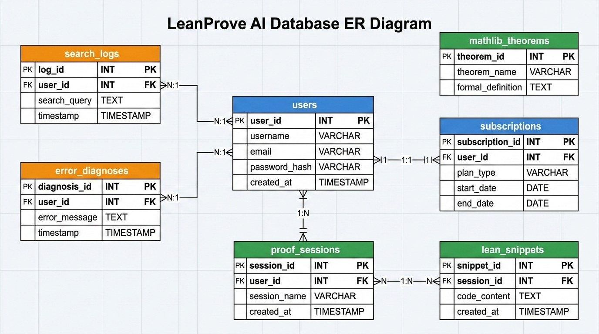

# 数据模型设计 - LeanProve AI

## 1. 核心实体

| 实体 | 描述 | 主键 |
|------|------|------|
| users | 用户账户 | id (UUID) |
| subscriptions | 订阅信息 | id (UUID) |
| proof_sessions | 证明会话 | id (UUID) |
| lean_snippets | Lean 代码片段 | id (UUID) |
| mathlib_theorems | Mathlib 定理向量表 | id (UUID) |
| search_logs | 搜索日志 | id (UUID) |
| error_diagnoses | 错误诊断记录 | id (UUID) |

## 2. 关系说明

- users 1:1 subscriptions（每用户一个活跃订阅）
- users 1:N proof_sessions（用户拥有多个证明会话）
- proof_sessions 1:N lean_snippets（会话含多个代码版本）
- users 1:N search_logs（用户搜索历史）
- users 1:N error_diagnoses（用户诊断历史）
- mathlib_theorems 独立表，无外键关联用户

---

## 3. 表结构与 DDL

### 3.1 users

| 字段 | 类型 | 约束 | 描述 |
|------|------|------|------|
| id | UUID | PK, DEFAULT gen_random_uuid() | 主键 |
| email | VARCHAR(255) | UNIQUE, NOT NULL | 邮箱 |
| display_name | VARCHAR(100) | NOT NULL | 显示名 |
| avatar_url | TEXT | | 头像 URL |
| github_id | VARCHAR(50) | UNIQUE | GitHub ID |
| role | VARCHAR(20) | DEFAULT 'free' | free/researcher/lab/admin |
| locale | VARCHAR(5) | DEFAULT 'en' | 界面语言 |
| usage_count_month | INTEGER | DEFAULT 0 | 当月用量 |
| created_at | TIMESTAMPTZ | DEFAULT NOW() | 创建时间 |
| updated_at | TIMESTAMPTZ | DEFAULT NOW() | 更新时间 |

```sql
CREATE TABLE users (
  id UUID PRIMARY KEY DEFAULT gen_random_uuid(),
  email VARCHAR(255) UNIQUE NOT NULL,
  display_name VARCHAR(100) NOT NULL,
  avatar_url TEXT,
  github_id VARCHAR(50) UNIQUE,
  role VARCHAR(20) NOT NULL DEFAULT 'free',
  locale VARCHAR(5) NOT NULL DEFAULT 'en',
  usage_count_month INTEGER NOT NULL DEFAULT 0,
  created_at TIMESTAMPTZ NOT NULL DEFAULT NOW(),
  updated_at TIMESTAMPTZ NOT NULL DEFAULT NOW()
);

CREATE INDEX idx_users_email ON users(email);
CREATE INDEX idx_users_github_id ON users(github_id);
CREATE INDEX idx_users_role ON users(role);
```

### 3.2 subscriptions

| 字段 | 类型 | 约束 | 描述 |
|------|------|------|------|
| id | UUID | PK | 主键 |
| user_id | UUID | FK users.id, UNIQUE | 用户 |
| plan | VARCHAR(20) | NOT NULL | free/researcher/lab |
| stripe_customer_id | VARCHAR(50) | | Stripe 客户 ID |
| stripe_subscription_id | VARCHAR(50) | | Stripe 订阅 ID |
| status | VARCHAR(20) | NOT NULL | active/canceled/past_due |
| current_period_start | TIMESTAMPTZ | | 当期开始 |
| current_period_end | TIMESTAMPTZ | | 当期结束 |
| created_at | TIMESTAMPTZ | DEFAULT NOW() | |
| updated_at | TIMESTAMPTZ | DEFAULT NOW() | |

```sql
CREATE TABLE subscriptions (
  id UUID PRIMARY KEY DEFAULT gen_random_uuid(),
  user_id UUID NOT NULL UNIQUE REFERENCES users(id) ON DELETE CASCADE,
  plan VARCHAR(20) NOT NULL DEFAULT 'free',
  stripe_customer_id VARCHAR(50),
  stripe_subscription_id VARCHAR(50),
  status VARCHAR(20) NOT NULL DEFAULT 'active',
  current_period_start TIMESTAMPTZ,
  current_period_end TIMESTAMPTZ,
  created_at TIMESTAMPTZ NOT NULL DEFAULT NOW(),
  updated_at TIMESTAMPTZ NOT NULL DEFAULT NOW()
);

CREATE INDEX idx_subscriptions_user_id ON subscriptions(user_id);
CREATE INDEX idx_subscriptions_stripe_customer ON subscriptions(stripe_customer_id);
CREATE INDEX idx_subscriptions_status ON subscriptions(status);
```

### 3.3 proof_sessions

| 字段 | 类型 | 约束 | 描述 |
|------|------|------|------|
| id | UUID | PK | 主键 |
| user_id | UUID | FK users.id | 用户 |
| title | VARCHAR(200) | NOT NULL | 会话标题 |
| description | TEXT | | 自然语言描述 |
| current_code | TEXT | | 当前代码 |
| compilation_status | VARCHAR(20) | | success/error/pending |
| last_error | TEXT | | 最近编译错误 |
| metadata | JSONB | DEFAULT '{}' | 额外元数据 |
| created_at | TIMESTAMPTZ | DEFAULT NOW() | |
| updated_at | TIMESTAMPTZ | DEFAULT NOW() | |

```sql
CREATE TABLE proof_sessions (
  id UUID PRIMARY KEY DEFAULT gen_random_uuid(),
  user_id UUID NOT NULL REFERENCES users(id) ON DELETE CASCADE,
  title VARCHAR(200) NOT NULL,
  description TEXT,
  current_code TEXT,
  compilation_status VARCHAR(20) DEFAULT 'pending',
  last_error TEXT,
  metadata JSONB NOT NULL DEFAULT '{}',
  created_at TIMESTAMPTZ NOT NULL DEFAULT NOW(),
  updated_at TIMESTAMPTZ NOT NULL DEFAULT NOW()
);

CREATE INDEX idx_proof_sessions_user_id ON proof_sessions(user_id);
CREATE INDEX idx_proof_sessions_created_at ON proof_sessions(created_at DESC);
CREATE INDEX idx_proof_sessions_status ON proof_sessions(compilation_status);
```

### 3.4 lean_snippets

| 字段 | 类型 | 约束 | 描述 |
|------|------|------|------|
| id | UUID | PK | 主键 |
| session_id | UUID | FK proof_sessions.id | 所属会话 |
| version | INTEGER | NOT NULL | 版本号 |
| code | TEXT | NOT NULL | Lean 4 代码 |
| source | VARCHAR(20) | NOT NULL | user_input/ai_generated/ai_fixed |
| compilation_result | JSONB | | 编译结果 |
| created_at | TIMESTAMPTZ | DEFAULT NOW() | |

```sql
CREATE TABLE lean_snippets (
  id UUID PRIMARY KEY DEFAULT gen_random_uuid(),
  session_id UUID NOT NULL REFERENCES proof_sessions(id) ON DELETE CASCADE,
  version INTEGER NOT NULL,
  code TEXT NOT NULL,
  source VARCHAR(20) NOT NULL DEFAULT 'user_input',
  compilation_result JSONB,
  created_at TIMESTAMPTZ NOT NULL DEFAULT NOW(),
  UNIQUE(session_id, version)
);

CREATE INDEX idx_lean_snippets_session_id ON lean_snippets(session_id);
CREATE INDEX idx_lean_snippets_source ON lean_snippets(source);
```

### 3.5 mathlib_theorems

| 字段 | 类型 | 约束 | 描述 |
|------|------|------|------|
| id | UUID | PK | 主键 |
| name | VARCHAR(300) | UNIQUE, NOT NULL | 定理全名 |
| short_name | VARCHAR(100) | NOT NULL | 短名 |
| type_signature | TEXT | NOT NULL | 类型签名 |
| module_path | VARCHAR(300) | NOT NULL | 模块路径 |
| doc_string | TEXT | | 文档注释 |
| source_url | TEXT | | 源码链接 |
| embedding | VECTOR(1536) | | 向量 (pgvector备用) |
| mathlib_version | VARCHAR(20) | NOT NULL | Mathlib 版本 |
| updated_at | TIMESTAMPTZ | DEFAULT NOW() | |

```sql
-- 注：主向量检索使用 Chroma，此表用于元数据查询和备份
CREATE EXTENSION IF NOT EXISTS vector;

CREATE TABLE mathlib_theorems (
  id UUID PRIMARY KEY DEFAULT gen_random_uuid(),
  name VARCHAR(300) UNIQUE NOT NULL,
  short_name VARCHAR(100) NOT NULL,
  type_signature TEXT NOT NULL,
  module_path VARCHAR(300) NOT NULL,
  doc_string TEXT,
  source_url TEXT,
  embedding VECTOR(1536),
  mathlib_version VARCHAR(20) NOT NULL,
  updated_at TIMESTAMPTZ NOT NULL DEFAULT NOW()
);

CREATE INDEX idx_mathlib_name ON mathlib_theorems(name);
CREATE INDEX idx_mathlib_short_name ON mathlib_theorems(short_name);
CREATE INDEX idx_mathlib_module ON mathlib_theorems(module_path);
CREATE INDEX idx_mathlib_embedding ON mathlib_theorems USING ivfflat (embedding vector_cosine_ops) WITH (lists = 200);
```

### 3.6 search_logs

| 字段 | 类型 | 约束 | 描述 |
|------|------|------|------|
| id | UUID | PK | 主键 |
| user_id | UUID | FK users.id | 用户 |
| query | TEXT | NOT NULL | 搜索查询 |
| results_count | INTEGER | | 结果数 |
| top_result | VARCHAR(300) | | 首位结果定理名 |
| response_time_ms | INTEGER | | 响应时间 |
| created_at | TIMESTAMPTZ | DEFAULT NOW() | |

```sql
CREATE TABLE search_logs (
  id UUID PRIMARY KEY DEFAULT gen_random_uuid(),
  user_id UUID REFERENCES users(id) ON DELETE SET NULL,
  query TEXT NOT NULL,
  results_count INTEGER,
  top_result VARCHAR(300),
  response_time_ms INTEGER,
  created_at TIMESTAMPTZ NOT NULL DEFAULT NOW()
);

CREATE INDEX idx_search_logs_user_id ON search_logs(user_id);
CREATE INDEX idx_search_logs_created_at ON search_logs(created_at DESC);
```

### 3.7 error_diagnoses

| 字段 | 类型 | 约束 | 描述 |
|------|------|------|------|
| id | UUID | PK | 主键 |
| user_id | UUID | FK users.id | 用户 |
| input_code | TEXT | NOT NULL | 输入代码 |
| error_message | TEXT | | 原始错误 |
| diagnosis | JSONB | NOT NULL | AI 诊断结果 |
| fix_applied | BOOLEAN | DEFAULT false | 是否采用修复 |
| created_at | TIMESTAMPTZ | DEFAULT NOW() | |

```sql
CREATE TABLE error_diagnoses (
  id UUID PRIMARY KEY DEFAULT gen_random_uuid(),
  user_id UUID REFERENCES users(id) ON DELETE SET NULL,
  input_code TEXT NOT NULL,
  error_message TEXT,
  diagnosis JSONB NOT NULL DEFAULT '{}',
  fix_applied BOOLEAN NOT NULL DEFAULT false,
  created_at TIMESTAMPTZ NOT NULL DEFAULT NOW()
);

CREATE INDEX idx_error_diagnoses_user_id ON error_diagnoses(user_id);
CREATE INDEX idx_error_diagnoses_created_at ON error_diagnoses(created_at DESC);
```

---

## 4. 数据迁移策略

| 阶段 | 策略 |
|------|------|
| 工具 | Supabase Migrations (基于 SQL 文件的版本化迁移) |
| 命名 | `YYYYMMDDHHMMSS_description.sql` |
| 回滚 | 每个迁移附带 down.sql |
| Mathlib 更新 | 每周 CI 自动拉取 Mathlib 最新版，重建 embedding，双写切换 |
| 数据清理 | search_logs / error_diagnoses 保留 90 天，自动归档到冷存储 |

---

## 5. 缓存设计

| 缓存项 | Key 模式 | TTL | 策略 |
|--------|----------|-----|------|
| 搜索结果 | `search:{query_hash}:{top_k}` | 1 小时 | Cache-aside |
| 用户月用量 | `usage:{user_id}:{year_month}` | 当月底 | Write-through |
| 定理元数据 | `theorem:{name}` | 24 小时 | Cache-aside |
| 用户 Session | `session:{jwt_id}` | 与 JWT 同步 | Write-through |
| 编译结果 | `compile:{code_hash}` | 6 小时 | Cache-aside |

---

## 6. ER 图提示词

```
Create an ER diagram for "LeanProve AI" database.
Entities: users (center), subscriptions (1:1 to users), proof_sessions (1:N from
users), lean_snippets (1:N from proof_sessions), mathlib_theorems (standalone),
search_logs (N:1 to users), error_diagnoses (N:1 to users).
Show primary keys, foreign keys, and key fields. Use crow's foot notation.
Color scheme: blue for user-related, green for content, orange for logs.
Layout: users at center, subscriptions to the right, proof_sessions and
lean_snippets below, search_logs and error_diagnoses to the left,
mathlib_theorems top-right standalone.
Style: clean database diagram, Nano Banana Pro format, 1920x1080.
```



