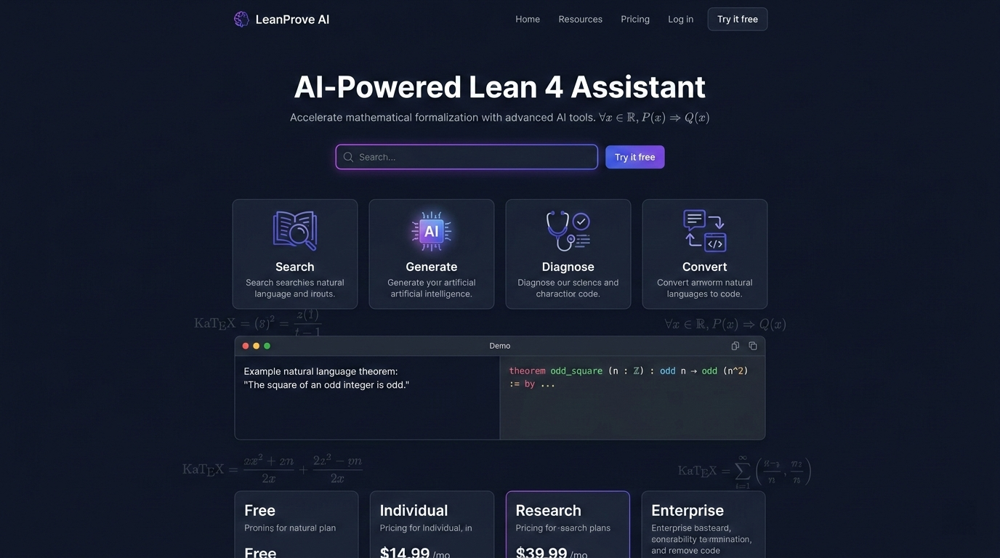
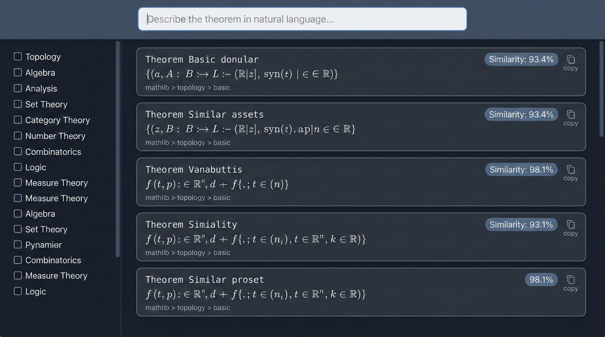
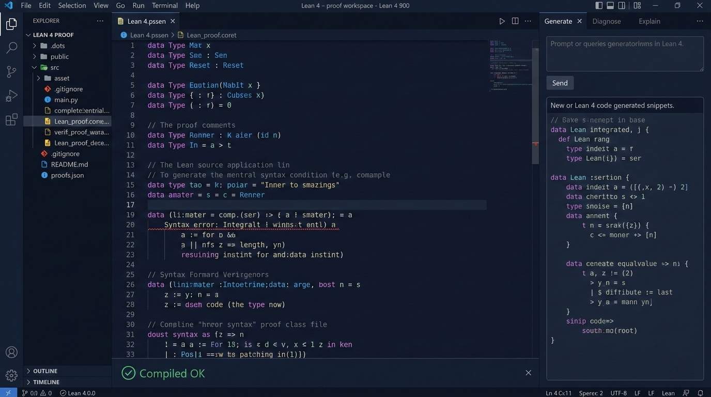
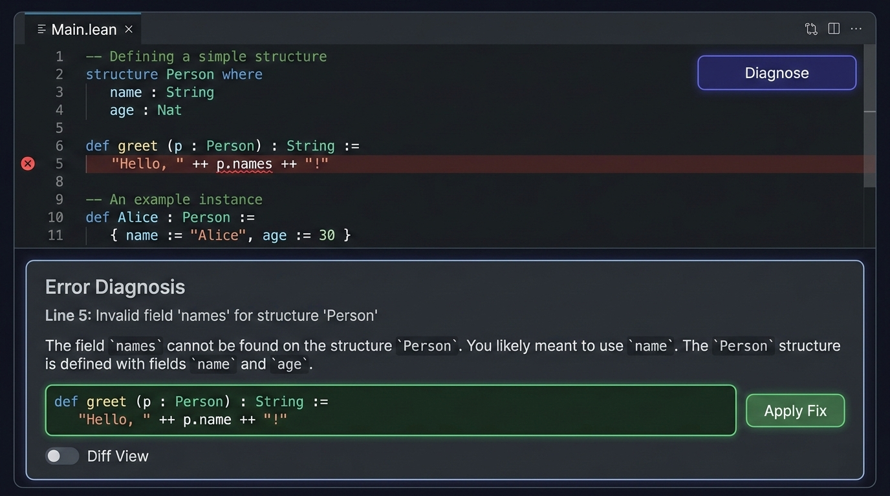
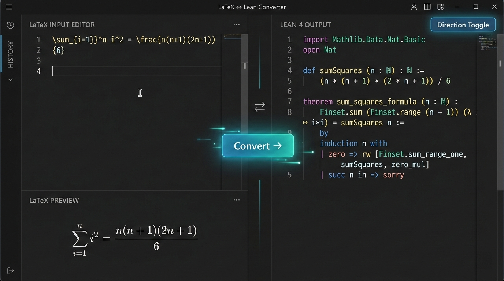
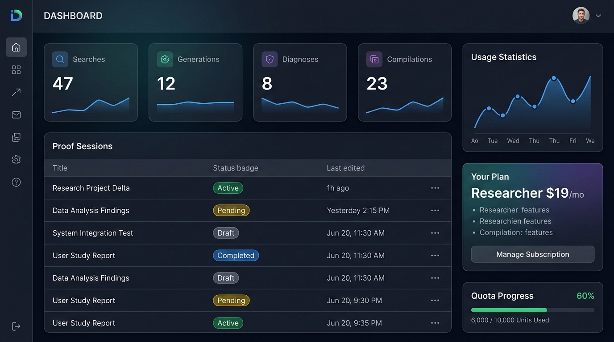

# UI 设计规范 - LeanProve AI

## 1. 设计系统

### 色彩
| 名称 | 色值 | 用途 |
|------|------|------|
| Primary | #6366F1 (Indigo) | 主操作按钮、链接 |
| Primary Dark | #4338CA | 悬停状态 |
| Secondary | #8B5CF6 (Violet) | 次要操作 |
| Success | #22C55E | 编译成功 |
| Error | #EF4444 | 编译错误 |
| Warning | #F59E0B | 警告 |
| BG Dark | #0F172A | 编辑器背景 |
| Surface | #1E293B | 卡片背景 |
| Text Primary | #F8FAFC | 主文字 (Dark) |
| Text Secondary | #94A3B8 | 次要文字 |

### 字体
- 界面: Inter, 14px/1.5
- 代码: JetBrains Mono, 14px/1.6
- 数学公式: KaTeX 默认字体
- 标题: Inter Bold, 24/20/16px (H1/H2/H3)

### 间距
- 基础单元: 4px
- 组件内间距: 12-16px
- 组件间距: 16-24px
- 页面边距: 24-48px

---

## 2. 页面列表

| 编号 | 页面 | 路径 |
|------|------|------|
| P1 | 首页/Landing | `/` |
| P2 | 语义搜索 | `/search` |
| P3 | 证明工作台 | `/workspace` |
| P4 | 错误诊断 | `/diagnose` |
| P5 | LaTeX 转换器 | `/convert` |
| P6 | 用户仪表盘 | `/dashboard` |
| P7 | 定价页面 | `/pricing` |
| P8 | 设置页面 | `/settings` |

---

## 3. 页面详情

### P1: 首页/Landing

**布局**: 全宽 Hero 区 + 功能展示网格 + 定价区 + Footer

**组件清单**:
- Hero: 标题 + 副标题 + 搜索框（直接体验语义搜索）+ CTA 按钮
- FeatureGrid: 4 列卡片（搜索/生成/诊断/转换）各含图标+描述
- DemoSection: 嵌入式 CodeMirror 交互 Demo
- PricingCards: 4 档定价对比卡片
- Testimonials: 3 个用户评价卡片
- Footer: 链接 + GitHub + 文档

**状态**: 静态页面，搜索框可直接提交跳转

**原型图提示词**:
```
Landing page for "LeanProve AI" math proof assistant. Dark theme (#0F172A bg).
Hero section: large title "AI-Powered Lean 4 Assistant", subtitle with math
symbols, centered search bar with purple gradient border, "Try it free" button.
Below: 4 feature cards in a row (Search, Generate, Diagnose, Convert) with
indigo icons. Demo section showing split-pane: left=natural language, right=
Lean 4 code with syntax highlighting. Pricing section with 4 cards.
Style: modern SaaS, academic feel, KaTeX formulas as decoration.
Nano Banana Pro format, 1440x900 desktop view.
```




### P2: 语义搜索

**布局**: 顶部搜索栏 + 左侧过滤器 + 右侧结果列表

**组件清单**:
- SearchBar: 大输入框 + 语言选择 + Top-K 滑块
- FilterPanel: 模块过滤器（Topology/Algebra/Analysis...）复选框
- ResultsList: 定理卡片列表，每张含定理名、类型签名（KaTeX 渲染）、模块路径、相似度分数、"复制"/"查看文档"按钮
- SearchHistory: 侧边栏历史搜索列表

**状态**:
- idle: 空搜索框 + 热门搜索推荐
- loading: 骨架屏
- results: 结果列表
- empty: 无结果 + 建议

**原型图提示词**:
```
Mathlib semantic search page. Dark theme. Top: large search input with placeholder
"Describe the theorem in natural language...". Left sidebar: module filter checkboxes
(Topology, Algebra, Analysis, etc). Main area: result cards stacked vertically.
Each card shows: theorem name in monospace font, type signature rendered as math
formula (KaTeX), module path in gray, similarity score badge (93.4%), copy button.
5 results shown. Nano Banana Pro format, 1440x900.
```




### P3: 证明工作台

**布局**: 三栏 - 左侧文件树 | 中间 CodeMirror 编辑器 | 右侧 AI 面板

**组件清单**:
- FileTree: 会话中的代码文件列表
- CodeEditor: CodeMirror 6 + Lean 4 语法高亮 + 行号 + 错误标注
- CompilationBar: 底栏显示编译状态（✓/✗/⟳）+ Lean 版本
- AIPanel: 右侧面板含 Tab（生成/诊断/解释）
- GenerateTab: 自然语言输入 + "生成证明"按钮 + 结果代码块 + "插入编辑器"
- DiagnoseTab: "诊断当前代码"按钮 + 错误列表 + 修复建议
- ExplainTab: 选中 tactic → 显示自然语言解释
- GoalView: 浮动面板显示当前证明目标（Lean InfoView）

**状态**:
- editing: 正常编辑
- compiling: 编译中（底栏旋转图标）
- compiled_ok: 编译成功（底栏绿色 ✓）
- compiled_error: 编译失败（底栏红色 ✗ + 错误波浪线）
- generating: AI 生成中（右侧面板加载动画）

**原型图提示词**:
```
Lean 4 proof workspace IDE. Dark theme (#0F172A). Three-column layout.
Left: narrow file tree panel. Center: large code editor with Lean 4 syntax
highlighting (keywords in purple, types in blue, comments in gray), line numbers,
red squiggly underline on error. Bottom status bar: green checkmark "Compiled OK"
with Lean version. Right panel: tabs "Generate | Diagnose | Explain", currently
showing Generate tab with text input and generated Lean code below.
Nano Banana Pro format, 1440x900.
```




### P4: 错误诊断

**布局**: 上下分栏 - 上方代码输入 | 下方诊断结果

**组件清单**:
- CodeInput: CodeMirror 编辑器（粘贴代码）+ "诊断"按钮
- ErrorInput: 可选的错误信息文本框
- DiagnosisResult: 错误列表，每项含行号标注、原始错误、AI 解释、修复建议代码块
- DiffView: 原代码 vs 修复代码对比视图
- ApplyButton: "应用修复"一键替换

**状态**: idle / analyzing / results / no_errors

**原型图提示词**:
```
Error diagnosis page. Dark theme. Top half: code editor with Lean 4 code containing
red error highlights. "Diagnose" button (indigo). Bottom half: diagnosis card showing
line 5 error, explanation in plain language, and suggested fix in a green-bordered
code block with "Apply Fix" button. Diff view toggle available.
Nano Banana Pro format, 1440x900.
```




### P5: LaTeX 转换器

**布局**: 左右分栏 - 左 LaTeX 输入 | 右 Lean 输出（可切换方向）

**组件清单**:
- DirectionToggle: LaTeX→Lean / Lean→LaTeX 切换
- LeftEditor: LaTeX 输入 + KaTeX 实时预览
- RightEditor: Lean 输出 + 语法高亮
- ConvertButton: 居中转换按钮（带方向箭头）
- HistoryList: 最近转换记录

**状态**: idle / converting / result / error

**原型图提示词**:
```
LaTeX-Lean converter page. Dark theme. Split view with bidirectional arrow in center.
Left: LaTeX input editor with KaTeX preview below showing rendered formula.
Right: Lean 4 output with syntax highlighting. Direction toggle button at top.
Center: animated arrow button "Convert →". History sidebar collapsed.
Nano Banana Pro format, 1440x900.
```




### P6: 用户仪表盘

**布局**: 顶部统计卡片 + 中间会话列表 + 右侧用量图表

**组件清单**:
- StatsRow: 4 个统计卡片（本月搜索/生成/诊断/编译次数）
- SessionList: 证明会话列表（标题/状态/最后编辑时间）+ 搜索/排序
- UsageChart: 折线图展示每日用量趋势
- PlanCard: 当前订阅计划 + 升级按钮
- QuotaBar: 进度条显示配额使用情况

**状态**: loading / loaded / empty_sessions

**原型图提示词**:
```
User dashboard. Dark theme. Top: 4 stat cards (Searches: 47, Generations: 12,
Diagnoses: 8, Compilations: 23) with small sparkline charts. Middle: proof
sessions table with columns (Title, Status badge, Last edited). Right sidebar:
usage line chart, plan card "Researcher $19/mo", quota progress bar at 60%.
Nano Banana Pro format, 1440x900.
```




---

## 4. 交互规范

| 交互 | 规范 |
|------|------|
| 按钮反馈 | 点击后 150ms 内显示 loading spinner |
| 搜索 | 输入停止 300ms 后自动搜索（debounce） |
| 编辑器自动保存 | 编辑停止 3s 后自动保存到后端 |
| 错误提示 | Toast 通知，右上角，自动消失 5s |
| 代码复制 | 点击后按钮变为 ✓ "已复制"，2s 恢复 |
| 页面切换 | 骨架屏占位，无白屏闪烁 |
| 公式渲染 | KaTeX 渲染失败时显示原始 LaTeX 文本 |
| 键盘快捷键 | Ctrl+Enter 提交；Ctrl+S 保存；Ctrl+/ 搜索 |

## 5. 响应式断点

| 断点 | 宽度 | 布局调整 |
|------|------|----------|
| Desktop L | ≥1440px | 三栏完整展示 |
| Desktop | ≥1024px | 三栏，侧边栏可折叠 |
| Tablet | ≥768px | 双栏，AI 面板变为底部抽屉 |
| Mobile | <768px | 单栏，Tab 切换编辑器/AI 面板 |
